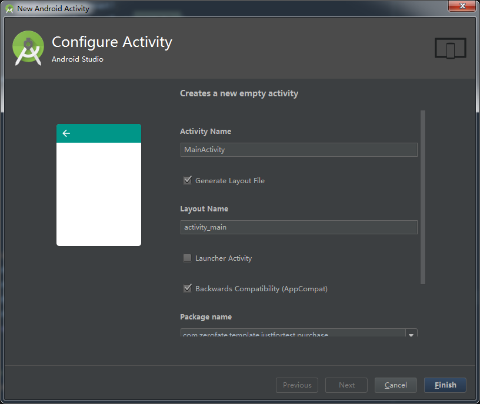

看完 [Mobile App Development: Tutorial How To Create Custom Android Code Templates](https://robusttechhouse.com/tutorial-how-to-create-custom-android-code-templates/#comments) 基本上就能了解整个的创建工程和一些基本知识。以下内容，仅作为个人的一些简单记录。（可能到最后也不一定简单。。。）     

先给本文定一个小目标：完全看懂 EmptyActivity 模板。

------

## 看懂 EmptyActivity

Android Studio 的模板文件放在`安装目录\plugins\android\lib\templates` 中，EmptyActivity 模板位于 `\activities\EmptyActivity` 。    

首先，看下目录：

+ root 文件夹
+ globals.xml.ftl
+ recipe.xml.ftl
+ template.xml
+ template_blank_activity.png

我第一眼看到这些文件时的第一个疑问是“ftl是什么”，后面慢慢看了些资料知道，ftl 全称 freemarker template language，[FreeMarker](http://freemarker.apache.org/) 是一个模板引擎。下面的一张图很好地表达了整个模板的作用过程：


其中，MyActivity.java.ftl 存放在 root 目录。现在，直接公布各个文件的作用：

- root 文件夹：要生成的模板源码和模板资源
- globals.xml.ftl：定义一些全局变量
- recipe.xml.ftl：包含生成代码的指令，recipe 将模板转为实际的代码
- template.xml：模板元数据，包括UI 元素的定义等
- template_blank_activity.png：不说了

下面依次看下各个文件的内容。

### template.xml

首先，看一下新建一个 EmptyActivity 时的界面



接着，是 template.xml 的内容（上图的内容主要在这里定义）：

（对于每个标签和属性的解释可以在 [Android ADT Template Format Document](http://www.i-programmer.info/professional-programmer/resources-and-tools/6845-android-adt-template-format-document.html) 中查看，这里只做对部分做解释）

```xml
<?xml version="1.0"?>
<template
    format="5" 
    revision="5"
    <!-- 模板名称 -->
    name="Empty Activity"
    minApi="9"
    minBuildApi="14"
    <!-- 模板描述内容，对应上图开头 -->
    description="Creates a new empty activity"> 

    <category value="Activity" />
    <formfactor value="Mobile" />

    <parameter
        id="instantAppActivityHost"
        name="Instant App URL Host"
        type="string"
        suggest="${companyDomain}"
        default="instantapp.example.com"
        visibility="isInstantApp!false"
        help="The domain to use in the Instant App route for this activity"/>

    <parameter
        id="instantAppActivityRouteType"
        name="Instant App URL Route Type"
        type="enum"
        default="pathPattern"
        visibility="isInstantApp!false"
        help="The type of route to use in the Instant App route for this activity" >
        <option id="path">Path</option>
        <option id="pathPrefix">Path Prefix</option>
        <option id="pathPattern">Path Pattern</option>
    </parameter>

    <parameter
        id="instantAppActivityRoute"
        name="Instant App URL Route"
        type="string"
        default="/.*"
        visibility="isInstantApp!false"
        help="The route to use in the Instant App route for this activity"/>

    <!-- parameter 表示可修改项，可以在其他地方通过 id 来获取它的值（即插值操作，形式如${}） -->
    <parameter
        id="activityClass"
        name="Activity Name"
        type="string"
        constraints="class|unique|nonempty"
        <!-- 为 parameter 自动生成值——当另一个 parameter 的值被修改时，如果该 parameter 的值仍为默认，那么将根据表达式所提供的结果修改该 parameter 的值，如此处的 layoutToActivity，-->
        suggest="${layoutToActivity(layoutName)}"
        default="MainActivity"
        help="The name of the activity class to create" />

    <parameter
        id="generateLayout"
        name="Generate Layout File"
        type="boolean"
        default="true"
        help="If true, a layout file will be generated" />

    <parameter
        id="layoutName"
        name="Layout Name"
        type="string"
        <!-- 值的约束条件 -->
        constraints="layout|unique|nonempty"
        suggest="${activityToLayout(activityClass)}"
        default="activity_main"
        visibility="generateLayout"
        help="The name of the layout to create for the activity" />

    <parameter
        id="isLauncher"
        name="Launcher Activity"
        type="boolean"
        default="false"
        help="If true, this activity will have a CATEGORY_LAUNCHER intent filter, making it visible in the launcher" />

    <parameter
        id="backwardsCompatibility"
        name="Backwards Compatibility (AppCompat)"
        type="boolean"
        default="true"
        help="If false, this activity base class will be Activity instead of AppCompatActivity" />
    
    <parameter
        id="packageName"
        name="Package name"
        type="string"
        constraints="package"
        default="com.mycompany.myapp" />

    <!-- 128x128 thumbnails relative to template.xml -->
    <thumbs>
        <!-- default thumbnail is required -->
        <thumb>template_blank_activity.png</thumb>
    </thumbs>

    <globals file="globals.xml.ftl" />
    <execute file="recipe.xml.ftl" />

</template>
```


### globals.xml.ftl

```xml
<?xml version="1.0"?>
<globals>
    <global id="hasNoActionBar" type="boolean" value="false" />
    <global id="parentActivityClass" value="" />
    <global id="simpleLayoutName" value="${layoutName}" />
    <global id="excludeMenu" type="boolean" value="true" />
    <global id="generateActivityTitle" type="boolean" value="false" />
    <#include "../common/common_globals.xml.ftl" />
</globals>
```

全局变量，<#include /> 用于引入 common_globals.xml.ftl 的内容。


### recipe.xml.ftl

用于将模板生成实际文件

```xml
<?xml version="1.0"?>
<#import "root://activities/common/kotlin_macros.ftl" as kt>
<recipe>
    <#include "../common/recipe_manifest.xml.ftl" />
    <@kt.addAllKotlinDependencies />
<#if generateLayout>
  	<!-- 生成布局文件 -->
    <#include "../common/recipe_simple.xml.ftl" />
  	<!-- 生成后打开文件 -->
    <open file="${escapeXmlAttribute(resOut)}/layout/${layoutName}.xml" />
</#if>

<#if generateKotlin>
    <instantiate from="root/src/app_package/SimpleActivity.kt.ftl"
                   to="${escapeXmlAttribute(srcOut)}/${activityClass}.kt" />
    <open file="${escapeXmlAttribute(srcOut)}/${activityClass}.kt" />
<#else>
  	<!-- 生成代码源码文件 -->
    <instantiate from="root/src/app_package/SimpleActivity.java.ftl"
                   to="${escapeXmlAttribute(srcOut)}/${activityClass}.java" />
    <!-- escapeXmlAttribute 对字符串践行转义，不是很理解 srcOut 在哪里定义，不过此处意思应该就是对srcOut 代表的字符串进行处理得到代码文件输出的目录 -->
    <open file="${escapeXmlAttribute(srcOut)}/${activityClass}.java" />
</#if>

</recipe>
```


## 基于 EmptyActivity 自定义 MVP Activity

生成文件包括：

* Activity 类
* （可选）layout 布局文件
* Presenter 实现类
* View 接口类

> 感觉使用 Contract 类有点多余，所以没加。如果需要写测试代码的话，将 presenter 类抽成 interface 还是有必要的。

* 找到模板目录，拷贝 EmptyActivity 文件夹，将新的文件夹命名为 MVPActivity。下面的修改基于 MVPActivity 目录下的文件。

  > 模板目录位置：AS安装目录\plugins\android\lib\templates\activities

* `template.xml` 文件修改

  * `name` 修改为 MVP Activity，重启 AS，在工程里就可以看到一个新的模板 MVP Activity
  * 修改 `parameter` 标签。parameter 定义了使用模板时可以配置的参数，参数类型包括：string、boolean 等。

* `recipe.xml.ftl` 文件修改。这个文件定义了如何生成实际的文件，要生成的文件的模板也是 ftl 格式文件，文件模板会读取 `template.xml` 和 `globals.xml.ftl` 中定义的变量来替换模板里的占位符。

  * 因为原有目录已经可以生成 Activity 和布局文件，所以我们需要创建的文件只有 View 接口类和 Presenter 实现类。

  * 在 `MVPActivity\root\src\app_package` 下新增两个文件：`SimpleView.java.ftl` 和 `SimplePresenter.java.ftl`。（我是基于 SimpleActivity.java.ftl 来修改的）

  * 接着就是为创建的两个 ftl 文件编写代码。可以先把一个手动编写的 java 文件复制进去，然后再使用模板变量来做修改。

    可以比对 SimpleActivity.java.ftl 和它实际生成 的 java 文件来编写。

    使用 `${}` 引用变量，这些变量声明包括：

    * `globals.xml.ftl` 

    *  `../common/common_globals.xml.ftl` 
    * `template.xml`  里面 <parameter> 的 id

    （有些使用不太清楚的可以参考其他模板）

    对于 View 和 Presenter 的命名，可以在 `template.xml` 中声明一个 id 为 featureName 的 parameter，然后再 ftl 模板文件中引用该变量。

  * 编写完 ftl 模板文件后，需要修改 `recipe.xml.ftl` 来生成实际文件。类似于

    ```xml
    <instantiate from="root/src/app_package/SimpleView.java.ftl"
                       to="${escapeXmlAttribute(srcOut)}/${featureName}View.java" />
        <instantiate from="root/src/app_package/SimplePresenter.java.ftl"
                       to="${escapeXmlAttribute(srcOut)}/${featureName}View.java" />
    ```

    （修改之后新建文件就可以看到效果，不需要重启 AS）


## 一些 FTL 语法

if 语句：

<#if>：FTL 的指令前会添加 #，自定义的指令是 @， # 并不是必须的


参考：    

[Android Studio自定义模板 写页面竟然可以如此轻松](http://blog.csdn.net/lmj623565791/article/details/51635533)

 [Mobile App Development: Tutorial How To Create Custom Android Code Templates](https://robusttechhouse.com/tutorial-how-to-create-custom-android-code-templates/#comments)    

[FreeMarker](http://freemarker.apache.org/)    

[FreeMarker 手册中文版（官网提供）](https://sourceforge.net/projects/freemarker/files/chinese-manual/)    

[Android ADT Template Format Document](http://www.i-programmer.info/professional-programmer/resources-and-tools/6845-android-adt-template-format-document.html)（该文档对Android代码模板的语法和形式进行了说明，也包括一些方法如 layoutToActivity 的解释，刚知道这个文档的时候有种相见恨晚的感觉）    

[android studio的自定义工程模板详解---让你开发神速的技巧](http://www.jianshu.com/p/c76facb61d69)    