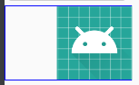

> 有时候设计师给的图标会因为没有边距而导致大小偏小，这时候如果我们直接使用图片并将 View 的大小设为 wrap_content，将导致触摸区域过小而显得触摸不灵敏。除了让 UI 重新给图标外（麻烦），我们也可以进行一些额外处理来增加边距。

+ 法一：

  在使用该图标的 view1 外层增加一个 view2，根据 view2 的事件来间接处理 view1，这样触摸区域大小将可以完全通过 view2 来设置。但这样将导致多加一个 view，并且间接处理会导致代码的增加。

+ 法二：

  利用 TouchDelegate 来增加触摸区域。示例代码：

  参考：[How to increase hit area of Android button without scaling background?](https://stackoverflow.com/questions/8176105/how-to-increase-hit-area-of-android-button-without-scaling-background)

  ```java
  final View parent = (View) button.getParent();  // button: the view you want to enlarge hit area
  parent.post( new Runnable() {
      public void run() { 
          final Rect rect = new Rect(); 
          button.getHitRect(rect); 
          rect.top -= 100;    // increase top hit area
          rect.left -= 100;   // increase left hit area
          rect.bottom += 100; // increase bottom hit area           
          rect.right += 100;  // increase right hit area
          parent.setTouchDelegate( new TouchDelegate( rect , button)); 
      } 
  }); 
  ```

  个人没有对该方法进行验证。

+ 法三：

  使用 inset。新建一个 drawable 文件，为该图标增加 inset。示例：

  ```xml
  <inset xmlns:android="http://schemas.android.com/apk/res/android"
      android:insetLeft="50dp"
      android:drawable="@mipmap/ic_launcher">
  </inset>
  ```

  