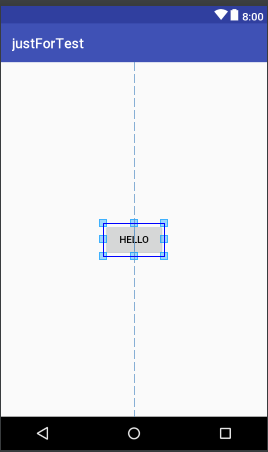

> 之所以注意到这个问题是因为新的需求需要对原控件的位置做出一些调整，但旧布局使用了居中效果，这时候我使用的偏移没有生效。

测试代码：

```xml
<?xml version="1.0" encoding="utf-8"?>
<RelativeLayout xmlns:android="http://schemas.android.com/apk/res/android"
    android:layout_width="match_parent"
    android:layout_height="match_parent">
    <Button
        android:layout_width="wrap_content"
        android:layout_height="wrap_content"
        android:layout_centerInParent="true"
        android:layout_marginLeft="500dp"
        android:text="Hello"/>
</RelativeLayout>
```

效果：



可以看到，margin 是没有生效的。

> layout_centerInParent 时，水平/垂直的 margin 无效；layout_centerVertical时，垂直的 margin 无效；layout_centerHorizontal 时，水平的 margin 无效。

如果需要实现居中+偏移的效果，方法有很多种：

1. 设置 RelativeLayout属性 android:gravity="center"

2. 添加一个用于占位的 View，通过它间接调整位置

   ```xml
   <?xml version="1.0" encoding="utf-8"?>
   <RelativeLayout xmlns:android="http://schemas.android.com/apk/res/android"
       android:layout_width="match_parent"
       android:layout_height="match_parent">
       <!-- 不要将该布局添加到任何界面，仅用于预览效果-->
       <LinearLayout
           android:layout_width="wrap_content"
           android:layout_height="wrap_content"
           android:layout_centerInParent="true">
           <View
               android:layout_width="0dp"
               android:layout_height="0dp"/>
           <Button
               android:layout_width="wrap_content"
               android:layout_height="wrap_content"
               android:text="Hello"/>
       </LinearLayout>
   </RelativeLayout>
   ```

3. 将 RelativeLayout 改为 ConstraintLayout 吧。。。


参考：

[How to align Button by center and make offset](https://stackoverflow.com/questions/13501891/how-to-align-button-by-center-and-make-offset)

> 上面参考文章中采用的 anchor 视图方式很有启发。