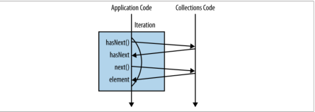
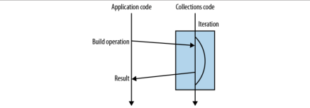

> Android

[java-8-lambdas-exercises](https://github.com/RichardWarburton/java-8-lambdas-exercises)

## lambda 表达式
```java
Runnable noArguments = () -> System.out.println("Hello World");
```

`()` 表示无参数，该 lambda 表达式实现了一个 Runnable，它只有唯一的不接受参数且无返回类型的方法 run。

```java
ActionListener oneArgument = event -> System.out.println("button clicked");
```

lambda 表达式带一个参数。

```java
Runnable multiStatement = () -> {
	System.out.print("Hello");
	System.out.println(" World");
};
```

具有代码块 的 lamda 表达式，该代码块与普通写法一致，比如返回、抛出异常。

```java
BinaryOperator<Long> add = (x, y) -> x + y;
```

用于多于一个参数的方法。需要注意，表达式并没有将两个数相加，它只是创建了一个用于相加的方法，`add` 变量是一个 `BinaryOperator<Long>` 而不是两个数相加的结果。

```java
BinaryOperator<Long> addExplicit = (Long x, Long y) -> x + y;
```

有时候，最好显式写出类型。


### functional interfaces

函数接口，用作 lambda 表达式类型的只有单个抽象方法的 interface。


### type inference

类型推断：javac 查找与 lambda 表达式相关的信息，然后使用这些信息来断定正确的类型。如：

```java
Predicate<Integer> atLeast5 = x -> x > 5;
```


## Streams

Java 8中最重要的核心库变化是围绕 Collections API 的 streams。

一个普通的迭代：

```java
int count = 0;
for (Artist artist : allArtists) {
if (artist.isFrom("London")) {
	count++;
	}
}
```

将上面的代码展开后，实际为：

```java
int count = 0;
Iterator<Artist> iterator = allArtists.iterator();
while(iterator.hasNext()) {
	Artist artist = iterator.next();
	if (artist.isFrom("London")) {
		count++;
	}
}
```

过程的第一步是创建一个 Iterator 对象来控制迭代过程，这种方式可以称为 external iteration。



 internal iteration 如下：

```java
long count = allArtists.stream()
				.filter(artist -> artist.isFrom("London"))
				.count();
```



我们去掉 count() 并加上打印：

```java
allArtists.stream()
          .filter(artist -> {
				System.out.println(artist.getName());
				return artist.isFrom("London");
});
```

上面的代码将什么都不会执行，filter 只是创建了一个 Stream 用法(recipe)，但没有被强制使用，像 filter 的这种方法是 **lazy** 的，而 count 这种会生成最终值的则被称作 **eager**。

判断一个操作符是 lazy 还是 eager ：如果返回的是 Stream 则是 lazy；返回的是另一个值或者 void 则是 eager。


### 常用的 Stream 操作符


## Java 8 的一些新特性

+  effectively final ：匿名内部类中是无法使用外部非 final 变量的，如果使用了外部没有 final 修饰的变量，那么这个变量将被认为是 effectively final 的，它只能被赋值一次。


