> 目前已知有道云笔记、Typora支持该语法，Github 不支持
## 基本语法
### Graph
声明新的 graph 以及方向
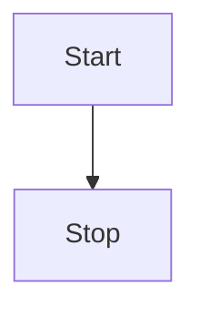
+ TB - top bottom
+ BT - bottom top
+ RL - right left
+ LR - left right
+ TD - 同 TB


### Nodes & shapes
**节点（默认）**

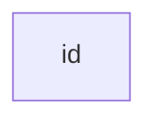
**带文本节点**

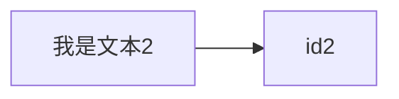
**圆边节点**

```
graph LR
    id1(我是文本)
```
**圆形节点**

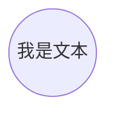
**不对称形状节点**

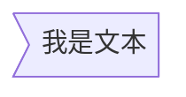
**菱形节点**

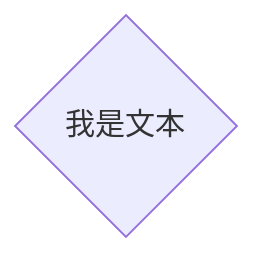

### 节点间的连接
可以使用不同类型的连接以及将文本关联到连接上

**带箭头连接**


**开放式连接**

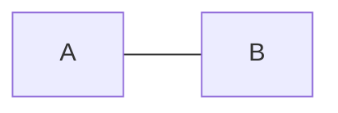
**连接中的文本**

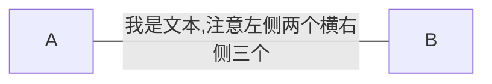
或者

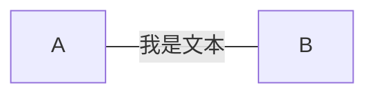
(链接中的文本使用括号会导致语法错误，个人觉得后一种方式更为方便，因为可以直接使用与普通连接线相同的符号)
**带箭头和文本的连接**

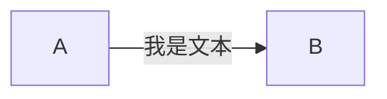
或者


**虚线连接**

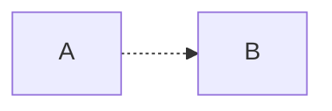
**虚线带文本连接**

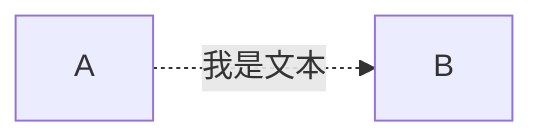
**粗线连接**

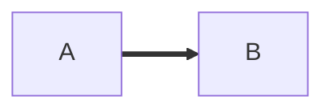
**粗线带文本连接**

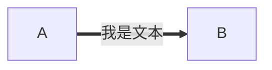

### 破坏语法的特殊字符
如，上面提到的括号无法使用。    

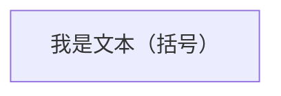
注意，语法中的双引号为半角

### 将代码转为转义字符

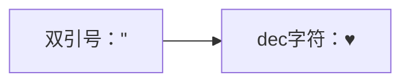

### 子图 Subgraphs

```
subgraph title
    graph definition
end
```
示例：

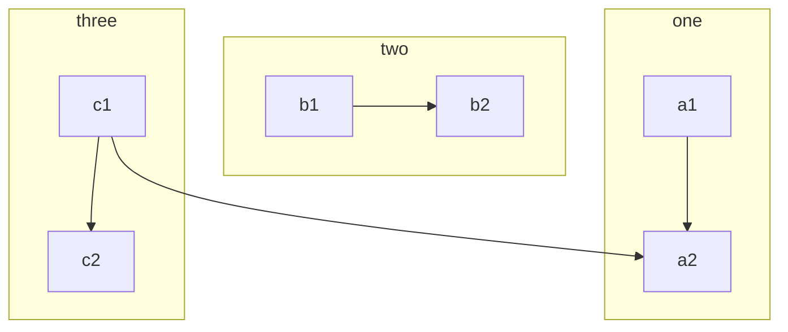

### 交互
将事件绑定到节点上，点击将导致 javascript 回调或者跳转到一个链接。

```
click nodeId callback
```
如：

```
<script>
    var callback = function(){
        alert('A callback was triggered');
    }
<script>
```

（上面的script没有作用，需要嵌到网页中才能执行？）


### 设置风格和类
（待）


## 个人习惯用法
+ 连接中添加文本采用箭头+双竖线语法
+ 文本统一添加双引号


参考：
[mermid flowchart](https://mermaidjs.github.io/flowchart.html)